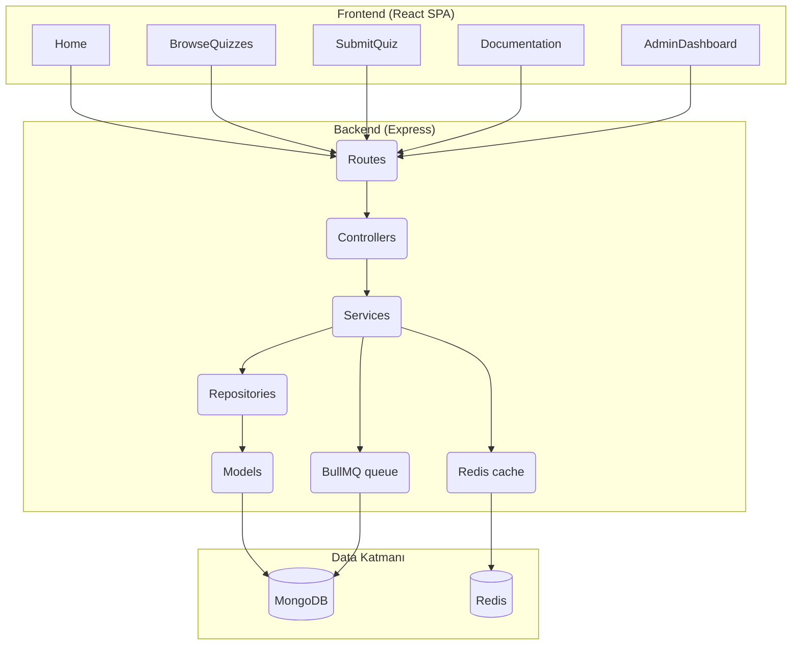

# TriviAPI Platformu

Modern quiz uygulamalarında kullanılmak üzere tasarlanmış tam kapsamlı bir trivia platformu. Bu monorepo içerisinde:

- **React tabanlı frontend**: API dokümantasyonu, demo quiz deneyimi ve yönetici panelini içeren SPA.
- **Express tabanlı backend**: Quiz CRUD, istatistikler, dış katkıların onay süreci ve yönetsel uçlar.
- **Test & otomasyon altyapısı**: Jest + Supertest ile entegrasyon testleri, scriptlerle admin kullanıcı tohumlama.

---

## İçindekiler

- [Mimari Genel Bakış](#mimari-genel-bakış)
- [Proje Yapısı](#proje-yapısı)
- [Özellikler](#özellikler)
- [Kurulum](#kurulum)
- [Çalıştırma](#çalıştırma)
- [Çevresel Ayarlar](#çevresel-ayarlar)
- [Testler](#testler)
- [Dağıtım](#dağıtım)
- [Yol Haritası](#yol-haritası)

---

## Mimari Genel Bakış



---

## Proje Yapısı

```
TriviAPIWeb
├── public/                  # CRA statik dosyaları
├── src/                     # Frontend sayfaları ve stiller
│   ├── pages/
│   ├── components/
│   ├── styles/
│   └── App.js
└── server/
    ├── server.js            # Express giriş noktası
    ├── package.json         # Backend özel konfig (type: module)
    └── src/
        ├── app.js
        ├── config/
        ├── controllers/
        ├── middleware/
        ├── models/
        ├── repositories/
        ├── routes/
        ├── services/
        ├── utils/
        ├── validations/
        └── jobs/
```

---

## Özellikler

### API
- `GET /api/quizzes/random` → Onaylanmış quizlerden filtreli rastgele çekiliş
- `POST /api/quizzes` → Yeni soru gönderimi (admin onayı bekler)
- `GET /api/quizzes/stats` → Quiz & submission istatistikleri
- `GET /api/quizzes/categories` → Mevcut kategori listesi
- `POST /api/admin/login` → JWT tabanlı yönetici girişi
- `GET /api/admin/quizzes/pending` → Bekleyen quiz listesi (RBAC korumalı)
- `POST /api/admin/quizzes/:id/approve|reject` → İnceleme akışı
- `GET /api/admin/stats` → Panel istatistikleri

### Frontend
- Landing & kullanım vaka bölümleri
- API referansı ve kod blokları
- Quiz çözme sayfası (filtreler, skor, feedback)
- Soru gönderme formu (validasyon, hata mesajları)
- Admin paneli: login, pending listesi, onay/ret işlemleri, istatistik kartları

### Opsiyonel Entegrasyonlar
- Redis cache → Kategori filtrelerinin cache’lenmesi
- BullMQ → Quiz served metriğinin arkaplanda güncellenmesi
- Pino logger + request trace id

---

## Kurulum

```bash
git clone https://github.com/<kullanıcı>/TriviAPIWeb.git
cd TriviAPIWeb
npm install
```

Backend için `.env` dosyasını oluştur:
```bash
cp server/.env.example server/.env
```

---

## Çalıştırma

Geliştirme ortamında frontend ve backend’i birlikte çalıştır:
```bash
npm run dev
```

Sadece backend:
```bash
npm run server
```

Sadece frontend:
```bash
npm start
```

Üretim build’i:
```bash
npm run build
```

---

## Çevresel Ayarlar

`server/.env` içerisinde doldurulması gereken kritik değerler:

```env
NODE_ENV=development
PORT=5000
MONGODB_URI=mongodb://localhost:27017/triviapi
JWT_ACCESS_SECRET=32+ karakterli gizli anahtar
JWT_REFRESH_SECRET=32+ karakterli gizli anahtar
JWT_ACCESS_EXPIRES_IN=15m
JWT_REFRESH_EXPIRES_IN=7d
RATE_LIMIT_WINDOW_MINUTES=1
RATE_LIMIT_MAX_REQUESTS=60
CORS_ORIGIN=http://localhost:3000
LOG_LEVEL=info
REDIS_URL=redis://localhost:6379           # opsiyonel
REDIS_CACHE_TTL_SECONDS=120                # opsiyonel
JOB_QUEUE_NAME=triviapi-jobs               # opsiyonel
```

### Admin Kullanıcısı Oluşturma
```bash
node server/scripts/seedAdmin.js \
  --username admin \
  --password Sifre123! \
  --displayName "Sistem Yöneticisi" \
  --permissions approve_quizzes reject_quizzes view_pending_quizzes view_stats
```

---

## Testler

Backend entegrasyon testleri:
```bash
npm run test:server
```
- MongoMemoryServer üzerinde izole DB ile çalışır
- health, quiz submission/approval, admin login senaryolarını kapsar

Frontend build sırasında CRA kaynaklı uyarılar için:
```bash
npx update-browserslist-db@latest
npm install --save-dev @babel/plugin-proposal-private-property-in-object
```

---

## Dağıtım

### Frontend (Render / Vercel / Netlify)
- `npm run build` → `build/` klasörü statik olarak sunulur
- Render için `render.yaml` hazırasında build komutları mevcut (React Router rewrite kuralı dâhil)

### Backend (Render / Heroku vb.)
- `node server/server.js`
- Env değişkenlerini ortamda tanımla
- Redis URL sağlamazsan cache + queue otomatik devre dışı kalır

---

## Yol Haritası

- Admin paneline audit log görüntüleme
- Quiz listeleme filtrelerinde redis priming stratejisi
- CI/CD: GitHub Actions ile test + build pipeline
- Frontend’i Vite veya Next.js üzerine taşıma (daha hızlı build, SSR opsiyonu)
- API için OpenAPI/Swagger dokümantasyon üretimi

---

## Katkı

- Issue açarak katkı fikrini paylaşabilirsin
- PR gönderirken `npm run test:server` ve `npm run build` komutlarını çalıştırman beklenir
- Kod stili ESLint + Prettier uyumlu
- Lisans: ISC
